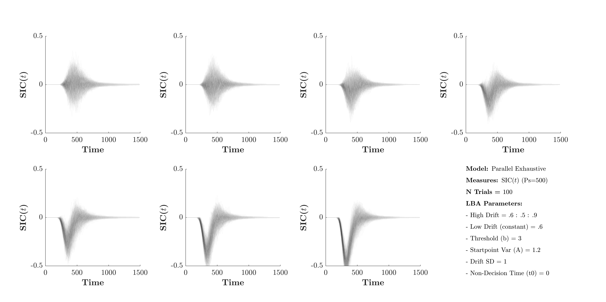
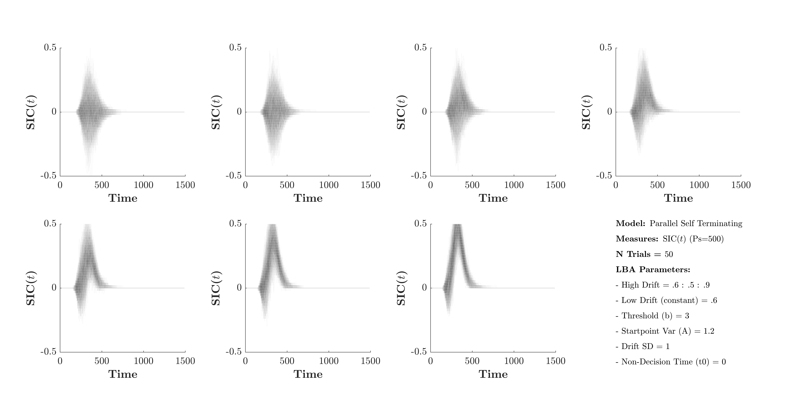
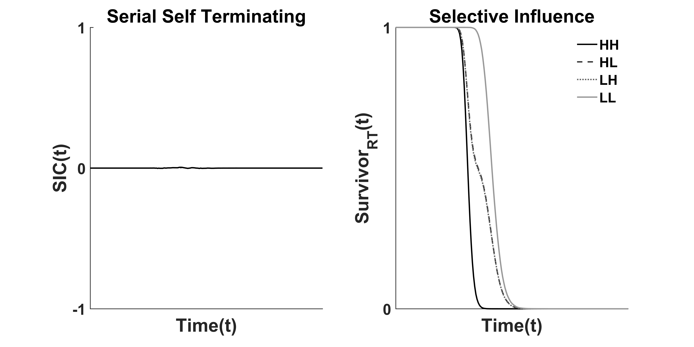
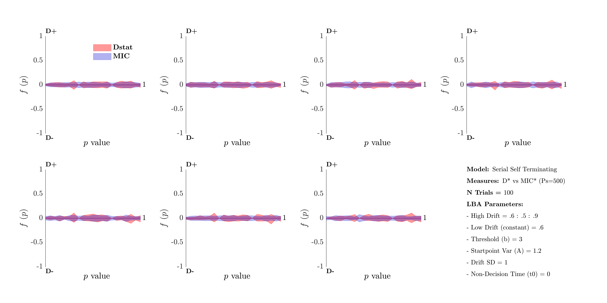
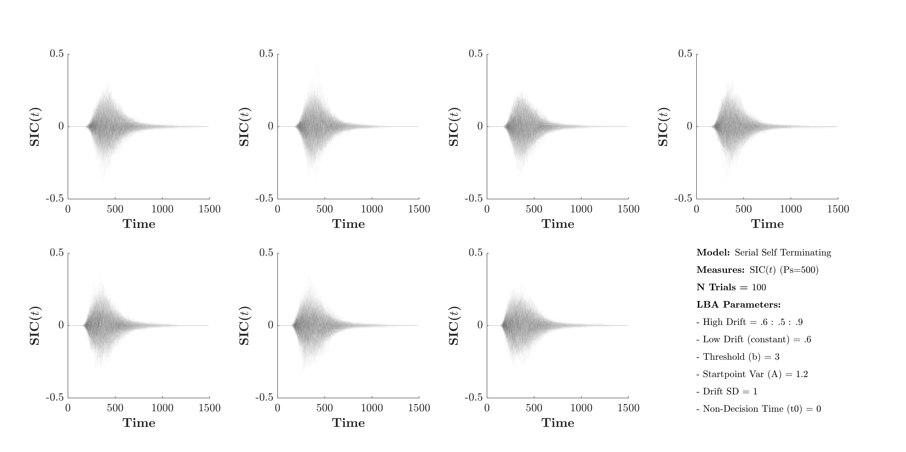

  

asdsak

# Selective Influence

# Mean Interaction Contrast (MIC)

# Survivor Interaction Contrast (SIC)

# D` Statistic
The  D statistic is a non-parametric test for assessing the empirical SIC(t)'s departure from zero (Houpt & Townsend, 2010). The D statistic is calculated for both the maximum and minimum points of the empirical SIC(t), giving a D+ and D- statistic. 

The D statistic utilises comparison of the SIC(t) to the maximum and minimum value of a Brownian Bridge, a stochastic process occurring over time with pdf drawn from the conditional probability of a Wiener process with start (t=0) and end points (t=T) anchored at zero and uncertainty greatest in the middle of the distribution. As such, interpretation of the D statistic should be understood as D+ denoting the largest positive value of a Brownian Bridge and D- the magnitude of the smallest value. 

Given the D statistic's calculation from a Brownian Bridge, a null hypothesis test can be ascertained with the null assuming the maximum SIC(t) positive and negative inflection resulting from the uncertainty of the underlying Brownian Bridge. 

The D statistic should be interpreted in conjunction with the MIC, as the presence of a D statistic alone is only weak evidence against the null (Houpt & Townsend, 2010).

## D-Hat vs MIC Significance Testing
_____________________________________________________________________
<b> Parallel Exhaustive </b>

  

<footer> Figure </footer> 

<b> Theoretical Expectations </b>

Measure         | Expect Significance | Description
:-------        |:----------:| :----------
MIC (mean)      |        | MIC should be negative
MIC Interaction |  True    | MIC Interaction should be significant. Hallmark of Parallel Processing
D+              |  False   | No significant positive deviation should be observed. See above SIC figure.
D-              |  True    | A significant negative deviation should be observed.

<b> Simulated Observations - Dhat vs MIC </b>

  

  

  

  

<b> Simulated Observations - Corresponding SICs </b>

  

  

  

  

_____________________________________________________________________
<b> Parallel Self Terminating </b>

  

<footer> Figure </footer> 

<b> Theoretical Expectations </b>

Measure         | Expect Significance | Description
:-------        |:----------:| :----------
MIC (mean)      |        | MIC should be positive
MIC Interaction |  True    | MIC Interaction should be significant. Hallmark of Parallel Processing
D+              |  True   | A significant positive deviation should be observed. See above SIC figure.
D-              |  False    | No significant negative deviation should be observed.

<b> Simulated Observations - Dhat vs MIC </b>

  

  

  

  

<b> Simulated Observations - Corresponding SICs </b>

  

  

  

  

_____________________________________________________________________
<b> Serial Exhaustive </b>

  

<footer> Figure </footer> 

<b> Theoretical Expectations </b>

Measure         | Expect Significance | Description
:-------        |:----------:| :----------
MIC (mean)      |        | MIC should be equal to zero
MIC Interaction |  False    | MIC Interaction should not be significant.
D+              |  True   | A significant positive deviation should be observed. See above SIC figure.
D-              |  True    | A significant negative deviation should be observed.

<b> Simulated Observations - Dhat vs MIC </b>

  

  

  

  

<b> Simulated Observations - Corresponding SICs </b>

  

  

  

  

_____________________________________________________________________
<b> Serial Self Terminating </b>

  

<footer> Figure </footer> 

<b> Theoretical Expectations </b>

Measure         | Expect Significance | Description
:-------        |:----------:| :----------
MIC (mean)      |        | MIC should be equal to zero
MIC Interaction |  False    | MIC Interaction should not be significant.
D+              |  False   | No significant positive deviation should be observed. 
D-              |  False    | No significant negative deviation should be observed. See above SIC figure.

<b> Simulated Observations - Dhat vs MIC </b>

  

  

  

  

<b> Simulated Observations - Corresponding SICs </b>

  

  

  

  

