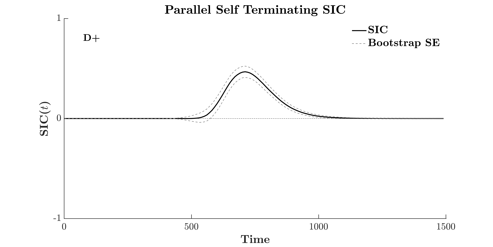
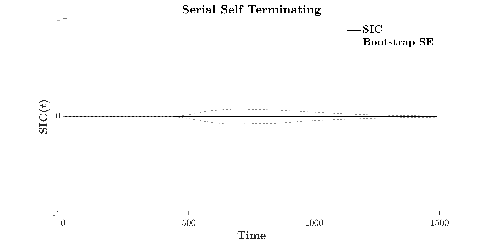
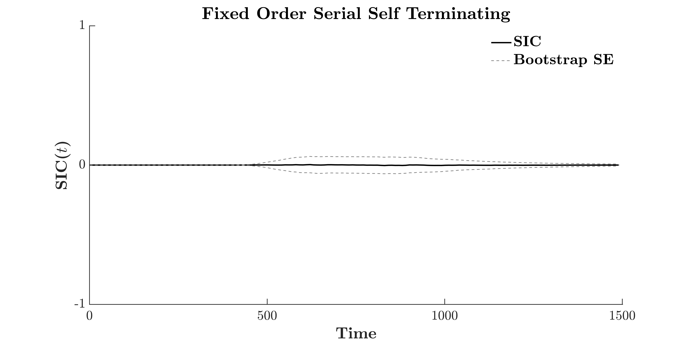
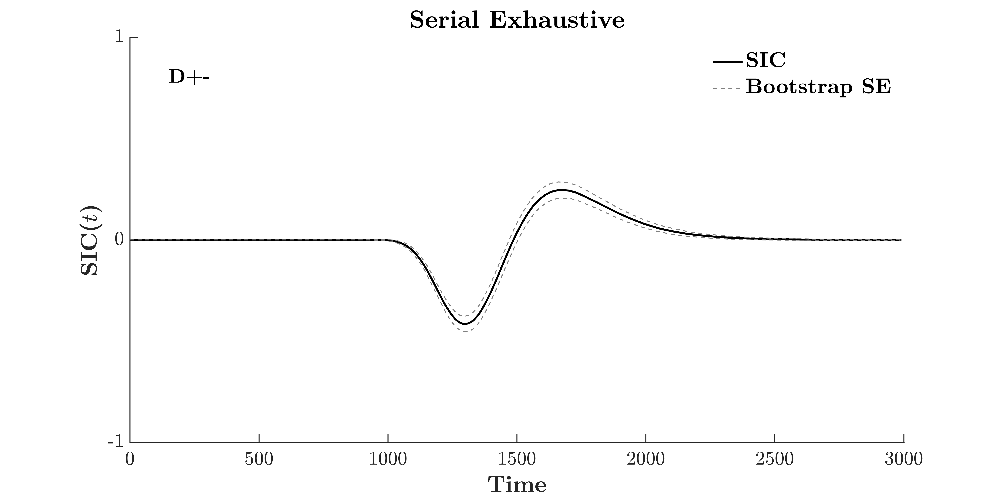
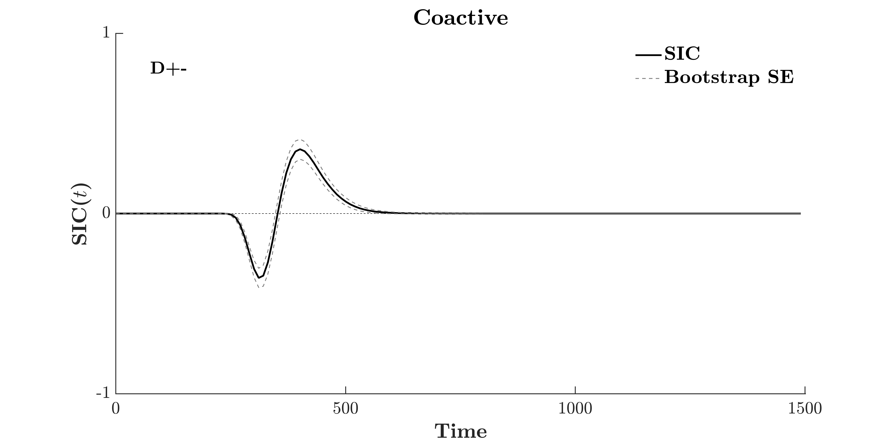

<center>  </center>

# Simulating Response Time Channels
In behavioural research, a subject's response time to the onset of an event or stimulus is assumed to act as an index the completion of a cognitive process.
In the framework of a Double-Factorial paradigm, response time acts to index the conclusion of a cognitive process. In some instances, this cognitive process might be the result of top-down processing. For example, the decision to apply a minimum-time or exhaustive search strategy, or to manually shift your focus of attention in a serial search. 

Other times, this strategic cognitive process involves bottom-up processing with non-conscious 

 For example, in a redundant target task where presence of either target is sufficient to generate a correct 'Yes' response, the strategic cognitive process is to perform a minimum-time search


# LBA SFT Simulations

The following will show how response time data for varying System Architectures can be simulated using the LBA.

<font size=5 color=dodgerblue><b> f_SimulateSFTnineLBA </font size></b>

Parameter | Type      | Description
:-------  |:----------| :----------
Model     | string    | String. Takes values 'SST', 'SSTfo', 'SE', 'PST', 'PE' and 'CoAct'.
DriftH    | double    | Drift rate for the High Salience evidence accumulation channel.
DriftL    | double    | Drift rate for the Low Salience evidence accumulation channel.
Threshold | double    | Response Threshold (b). Higher threshold results in slower response generation.
A         | double    | Start point variability. Maximum value of the uniform distribution U[0,A] between which the drift Start Point may occur.
SD        | double    | Standard deviation parameter for the normal distribution from which the drift rate is sampled.
Ntrials   | double    | Number of trials or Response Times to generate under the given parameter values.
SSTfoRand | boolean   | [Optional] True/False value. Fixes channel order as channel A first (True) or channel B first (False) for the Serial Self-Terminating fixed-order architecture.

<font size=4 color=dodgerblue><b> Returns </font size></b><p>

Parameter  |  Type  | Description
:--------- | :----- |:-----------
Data       | Matrix | An [Ntrials * 9] array of response times in milliseconds. Each column is a unique combination of load and salience, as described by the double-factorial design required for SFT.
ChannelData| Matrix | A [2 * Nrials * 4] 3D array of the channel completion times used when generating the response times returned by Data. Rows indicate Channel A and B respectively, columns are a given trial and the third-dimension is the unique load-salience combination of the double-target condition (see description below for ordering).

<font size=4 color=dodgerblue><b> Description </font size></b><p>
Calculates response times in milliseconds, using the Linear Ballistic Accumulator Model. Assumes t0 is zero for all time samples.

Returned Data Array columns match unique combinations of Load and Salience, as described in the Double-Factorial Paradigm necessary for SFT. The 3rd dimension of ChannelData maps to the four Double Target conditions of salience.

Column Number| Load       | Salience | Abbreviation
:---------: |:--------- :| :-----   :| :-----------:
1  |  Double Target |  High - High | AB HH
2  |Double Target |  High - Low  | AB HL
3  |Double Target |  Low - High | AB LH
4  |Double Target |  Low - Low | AB LL
5  |Single Target |  High | A H
6  |Single Target |  Low | A L
7  |Single Target |  High | B H
8  |Single Target |  Low  | B L
9  |No Target     |  Equates to High Salience | Nil

<font size=4 color=dodgerblue><b> Example </font size></b><p>

```matlab
Model = 'PST'; % also takes 'SST', 'SSTfo', 'SE', 'PE', 'CoAct'
DriftH = 1.6;
DriftL = 1.2;
Threshold = 1;
A = 0;
SD = .1;
Ntrials =  5;

RTData  = f_SimulateSFTnineLBA( Model, DriftH, DriftL, Threshold, A, SD, Ntrials)

RTData =

  Columns 1 through 7

  613.7729  612.3517  623.1915  856.7324  636.0393  822.2121  704.4101
  579.7154  641.5054  549.0849  866.4832  604.1681  819.4840  577.7402
  622.6277  711.6705  649.6865  771.3541  574.1917  871.7915  582.3475
  657.0529  594.3883  604.1735  829.4403  615.0549  874.6507  580.4431
  610.9254  630.9346  615.4763  813.0382  719.0946  794.3802  593.0726

  Columns 8 through 9

  851.3901  631.7892
  938.7937  642.8301
  838.4938  635.0806
  924.1590  643.8739
  728.9819  601.4685

% Returns optional output argument for Channel Response Times
[RTData, ChannelData]  = f_SimulateSFTnineLBA( Model, DriftH, DriftL, Threshold, A, SD, Ntrials);
ChannelData


ChannelData(:,:,1) =

  621.0754  695.5822  711.1573  657.0529  610.9254
  613.7729  579.7154  622.6277  662.7162  671.8474


ChannelData(:,:,2) =

  612.3517  641.5054  711.6705  594.3883  630.9346
  984.0588  810.8489  743.0004  752.8701  857.2904


ChannelData(:,:,3) =

  942.1947  796.9356  818.8018  949.7159  788.6477
  623.1915  549.0849  649.6865  604.1735  615.4763


ChannelData(:,:,4) =

   1.0e+03 *

    0.8567    0.8932    0.7714    0.9584    0.8130
    0.9304    0.8665    1.0846    0.8294    0.9580

```

# Random Walk SFT Simulations

The following will show how response time data for varying System Architectures can be simulated using the Random Walk Model.

<font size=5 color=dodgerblue><b> f_SimulateSFTnineRW </font size></b>

Parameter | Type      | Description
:-------  |:----------| :----------
Model     | string    | String. Takes values 'SST', 'SSTfo', 'SE', 'PST', 'PE' and 'CoAct'.
ProbH     | double    | Step Probability for the high salience condition.
ProbL     | double    | Step Probability for the low salience condition.
Threshold | double    | Response Threshold (b). Higher threshold results in slower response generation.
Ntrials   | double    | Number of trials or Response Times to generate under the given parameter values.
Nsamples  | double    | Number of step samples to be taken on each trial. Failure to reach a response threshold by Nsamples returns a no response NaN.

<font size=4 color=dodgerblue><b> Returns </font size></b><p> 

Parameter  |  Type  | Description
:--------- | :----- |:-----------
Data       | Array | 2D matrix with dimensions [ Ntrials * 9 ]. The nine columns constitute unique combinations of Load and Salience conditions within the Double Factorial Paradigm. See description below. Negative values typically indicate an incorrect response (the opposing decision bound was met), NaN values indicate no-response and positive values indicate a correct response.
ChannelData| Array | A [2 * Nrials * 4] 3D array of the channel completion times used when generating the response times returned by Data. Rows indicate Channel A and B respectively, columns are a given trial and the third-dimension is the unique load-salience combination of the double-target condition (see description below for ordering).

<font size=4 color=dodgerblue><b> Description </font size></b><p>
Calculates response times in milliseconds for the nine unique conditions that constitute the classical SFT double factorial paradigm, using the Linear Ballistic Accumulator Model. Assumes t0 is zero for all time samples.

Returned Data Array columns match unique combinations of Load and Salience, as described in the Double-Factorial Paradigm necessary for SFT.

Column Number| Load       | Salience | Abbreviation
:---------: |:--------- :| :-----   :| :-----------:
1  |  Double Target |  High - High | AB HH
2  |Double Target |  High - Low  | AB HL
3  |Double Target |  Low - High | AB LH
4  |Double Target |  Low - Low | AB LL
5  |Single Target |  High | A H
6  |Single Target |  Low | A L
7  |Single Target |  High | B H
8  |Single Target |  Low  | B L
9  |No Target     |  Equates to High Salience | Nil


<font size=4 color=dodgerblue><b> Example </font size></b><p>

```matlab
% Set Model and RW Parameter Values
ProbH = .7;
ProbL = .6;
Threshold = 20;
Ntrials = 5;
Nsamples = 250;

% Call Function
RTData = f_SimulateSFTnineRW( Model, ProbH, ProbL, Threshold, Ntrials, Nsamples )

RTData =

	56    76    32    64    44   112    56    56    38
    34    50    40    74    36    76    62    74    64
    42    38    42    60    32   208    50    72    26
    34    32    36    40    30    76    28    98    72
    38    34    42    76    36   112    48   112    44

% Also takes optional output arguments to return the Channel Response Times
[RTData, ChannelData] = f_SimulateSFTnineRW( Model, ProbH, ProbL, Threshold, Ntrials, Nsamples );

ChannelData

ChannelData(:,:,1) =

    56    38    42    40    46
    58    34    48    34    38


ChannelData(:,:,2) =

    76    50    38    32    34
   108   226    88    46    74


ChannelData(:,:,3) =

    32    48    50   118    64
    52    40    42    36    42


ChannelData(:,:,4) =

    64    74    94    88    98
    70    90    60    40    76

```

# Simulated System Architectures

<font size=5 color=dodgerblue><b> Parallel Self Terminating </font size></b>

```matlab
timebins = 1:10:1500;

RTData  = f_SimulateSFTnineLBA( 'PST', 1.6, 1.2, 1, 0, .2, 100000);

[SIC, bootstrap, dhat] = f_SIC(RTData(:,1:4), timebins, true, true );

f_PlotSIC( SIC, timebins, bootstrap, dhat, 'Parallel Self Terminating SIC', true );

```
<center>  </center>


<font size=5 color=dodgerblue><b> Parallel Exhaustive </font size></b>

```matlab
timebins = 1:10:1500;

RTData  = f_SimulateSFTnineLBA( 'PE', 1.6, 1.2, 1, 0, .2, 100000);

[SIC, bootstrap, dhat] = f_SIC(RTData(:,1:4), timebins, true, true );

f_PlotSIC( SIC, timebins, bootstrap, dhat, 'Parallel Exhaustive', true );
```

<center>  </center>


<font size=5 color=dodgerblue><b> Serial Self Terminating </font size></b>

```matlab
timebins = 1:10:1500;

RTData  = f_SimulateSFTnineLBA( 'SST', 1.6, 1.2, 1, 0, .2, 100000);

[SIC, bootstrap, dhat] = f_SIC(RTData(:,1:4), timebins, true, true );

f_PlotSIC( SIC, timebins, bootstrap, dhat, 'Serial Self Terminating', true );

```
<center>  </center>


<font size=5 color=dodgerblue><b> Fixed Order Serial Self-Terminating </font size></b>

```matlab
timebins = 1:10:1500;

RTData  = f_SimulateSFTnineLBA( 'SSTfo', 1.6, 1.2, 1, 0, .2, 100000);

[SIC, bootstrap, dhat] = f_SIC(RTData(:,1:4), timebins, true, true );

f_PlotSIC( SIC, timebins, bootstrap, dhat, 'Fixed Order Serial Self Terminating', true );

```
<center>  </center>

<font size=5 color=dodgerblue><b> Serial Exhaustive </font size></b>

```matlab
timebins = 1:10:3000;

RTData  = f_SimulateSFTnineLBA( 'SE', 1.6, 1.2, 1, 0, .2, 100000);

[SIC, bootstrap, dhat] = f_SIC(RTData(:,1:4), timebins, true, true );

f_PlotSIC( SIC, timebins, bootstrap, dhat, 'Serial Exhaustive', true );

```
<center>  </center>


<font size=5 color=dodgerblue><b> Parallel Coactive </font size></b>
```matlab
timebins = 1:10:1500;

RTData  = f_SimulateSFTnineLBA( 'CoAct', 1.6, 1.2, 1, 0, .2, 100000);

[SIC, bootstrap, dhat] = f_SIC(RTData(:,1:4), timebins, true, true );

f_PlotSIC( SIC, timebins, bootstrap, dhat, 'Coactive', true );
```
<center>  </center>