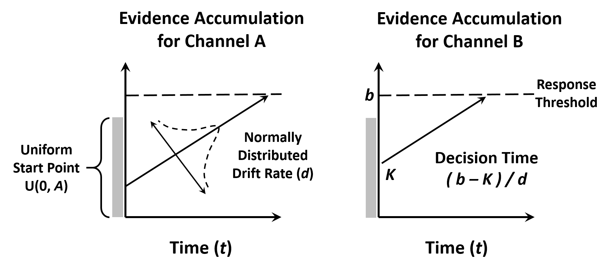
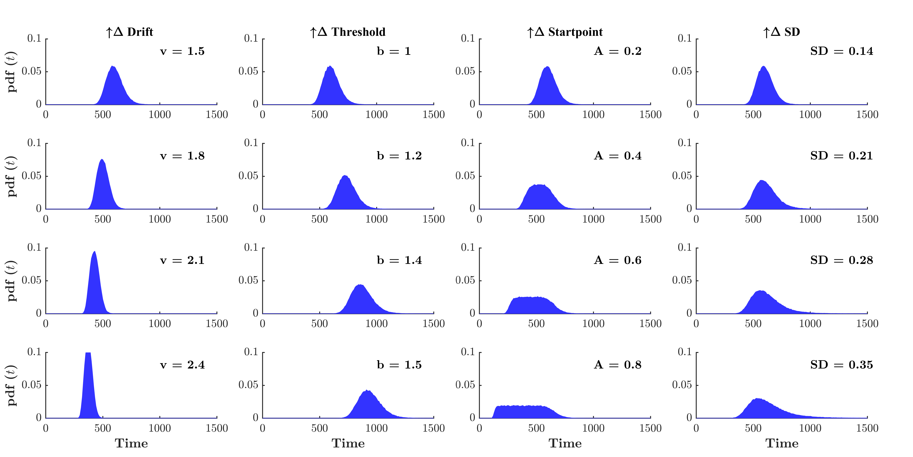

<center>  </center>


#  Simulating Response Time Data

The following section will discuss several accumulator models that may be used to generate the response-time predictions humans completing a range of tasks. The models we will cover will include the Linear Ballistic Accumulator Model, the Random Walk model, the Poisson Model and the Diffusion Model. Each of these models have unique benefits relative to one-another. Importantly, each model incorporates theoretically driven parameters not only predict human decision times, but help explain the cognitive processes that underpin these behaviours. Understanding how these models work is difficult for new students. The SFT with Matlab package is designed to make this process easier. It provides easy-to-understand functions that let you generate data using these methods, and along the way, appreciate how these models work. 

*Paul up to here 14/10/19, old content continues from here...*


## Linear Balistic Accumulator

Discuss the LBA here...

<center>  </center>
<footer><font size=2> 
*Figure 1.* Two Channel version of the Linear Ballistic Accumulator 
(LBA). Evidence for Channel A is gathered in the left hand accumulator, and for Channel B in 
the right hand accumulator. Starting values for the evidence accumulation process (e.g., *K*) are drawn randomly and independently from identical uniform distributions on the interval [0,*A*]. The drift rate (e.g., *d*) or speed of evidence accumulation is drawn independently for each accumulator from a normal distribution with standard deviation *s*. Under a self-terminating stopping rule, a response will trigger when the first accumulator reaches the threshold *b*.
</footer></font>


Discuss the LBA Paramaters here...

<font size=5 color=dodgerblue><b> Function f_LBA </font size></b>
	
Parameter | Type      | Description
:-------  |:----------| :----------
drift     | double    | Drift Rate (d) for the channel accumulator. Higher drift rates result in faster evidence accumulation
Threshold | double    | Response Threshold (b). Higher threshold results in slower response generation.
A         | double    | Start point variability. Maximum value of the uniform distribution U[0,A] between which the drift Start Point may occur
SD        | double    | Standard deviation parameter for the normal distribution from which the drift rate is sampled.
Ntrials   | double    | Number of trials or Response Times to generate under the given parameter values.


<font size=4 color=dodgerblue><b> Returns </font size></b><p> 
Returns a vector of response time values 1*Ntrials long.

<font size=4 color=dodgerblue><b> Description </font size></b><p>
Calculates response times in milliseconds, using the Linear Ballistic Accumulator Model. Assumes t0 is zero for all time samples.

<font size=4 color=dodgerblue><b> Example </font size></b> 
```matlab
% Set LBA Parameters
drift = 1.2;
Threshold = 1;
A = .50;
SD = .1;
Ntrials = 10;

% Call f_LBA Function
RT = f_LBA( drift, Threshold, A, SD, Ntrials )

RT =

  Columns 1 through 7

  510.5766  911.8206  677.4572  716.7259  761.8242  451.3118  512.7615

  Columns 8 through 10

  719.3998  426.9517  876.4842

```

<center>  </center>
<footer><font size=2> 
*Figure 2.* Probability density functions for response times generated using the f_LBA function given one-million trials. Columns moving left to right indicate increase parameter values for drift rate (d), threshold (b), start point variability (A), and the standard deviation of the drift (SD). Parameter values increase incrementally as indicated by the text of each subplot. The first row illustrates fixed parameter values for all columns. All response times are generated with the assumption of no error drift rate and a t0 = 0.
</footer></font>

## Random Walk Accumulator


Discuss background of Random Walk here

<font size=5 color=dodgerblue><b> Function f_RandomWalk </font size></b>
	
Parameter  | Type      | Description
:-------   |:----------| :----------
Probability| double    | Probability of each RW step. Probabilities above 0.5 will on average move towards the positive response threshold, while probabilities below 0.5 will on average step towards the negative response threshold.
Threshold  | double    | Response Threshold (b). Higher threshold results in slower response generation.
Ntrials    | double    | Number of Response time trials to generate
Nsamples   | double    | Number of Steps sampled for each trial. If Nsamples is less than required to reach a response threshold, a NaN value will be returned indicating no response was made.

<font size=4 color=dodgerblue><b> Returns </font size></b><p> 
Returns a vector of response time values Ntrials long. 

<font size=4 color=dodgerblue><b> Description </font size></b><p>
Calculates response times in milliseconds, using the Random Walk Model.

<font size=4 color=dodgerblue><b> Example </font size></b> 
```matlab
% Set RW Parameters
StepProb = .65;
Threshold = 250;
Ntrials = 10;
Nsamples = 1500;

% Call f_RandomWalk Function
RT = f_RandomWalk( StepProb, Threshold, Ntrials, Nsamples )

RT =

   982   860   840   850   972   968   862   770   896   740

```

<center>  </center>
<footer><font size=2> 
*Figure 3.* Probability density functions for response times generated using the f_RandomWalk function. Columns moving left to right indicate increase parameter values for step probability (p), threshold (b), number of trials (N), and the number of steps sampled for each trial RT (S) . Parameter values increase incrementally as indicated by the text of each subplot, except for Nsamples which decreases. The first row illustrates fixed parameter values for all columns. 
</footer></font>


