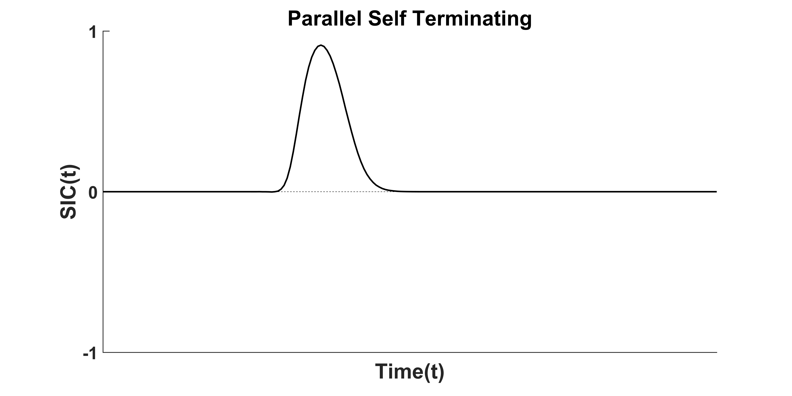
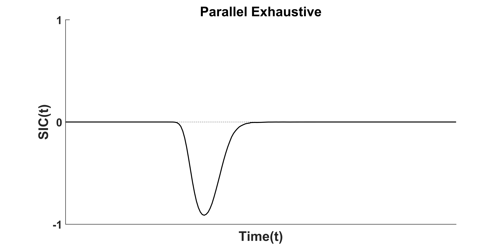
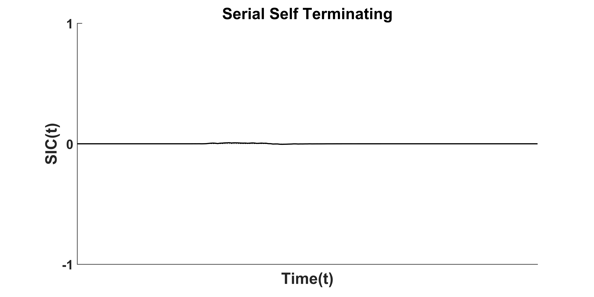
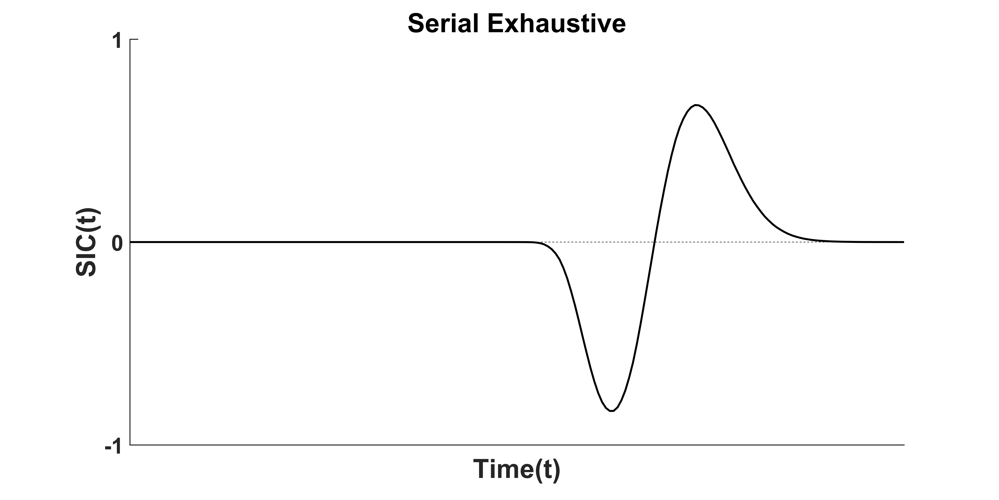
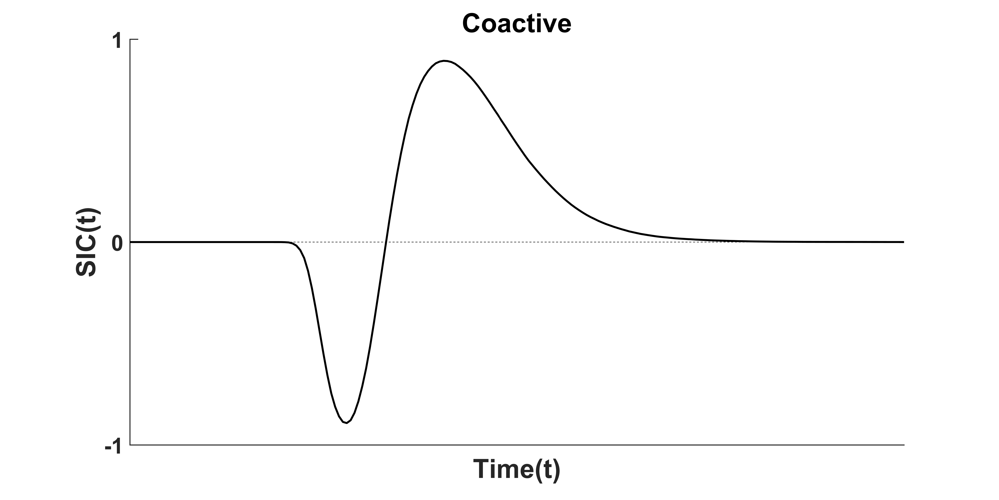

<center>  </center>


#  Simulating Response Time Data


## Linear Balistic Accumulator

Discuss the LBA here...

<center>  </center>
<footer><font size=2> 
*Figure 1.* Two Channel version of the Linear Ballistic Accumulator 
(LBA). Evidence for Channel A is gathered in the left hand accumulator, and for Channel B in 
the right hand accumulator. Starting values for the evidence accumulation process (e.g., *K*) are drawn randomly and independently from identical uniform distributions on the interval [0,*A*]. The drift rate (e.g., *d*) or speed of evidence accumulation is drawn independently for each accumulator from a normal distribution with standard deviation *s*. Under a self-terminating stopping rule, a response will trigger when the first accumulator reaches the threshold *b*.
</footer></font>

Discuss the LBA Paramaters here...

```matlab
% Function to generate response time data using the LBA model
% under the assumption of no error drift
% Function takes five input variables.
% drift      = Drift Rate
% Threshold  = Threshold for response selection
% A          = Distance to travel from UniDist to Threshold
% SD         = Within Trial Variability 
% Ntrials    = Number of LBA Trials to return
%
% E.g., LBA(4, 2.5, 1.5, 1, 100)
% Note: t0 = 0 for all time samples


RT = f_LBA( drift, Threshold, A, SD, Ntrials )


function [ RT ] = f_LBA( drift, Threshold, A, SD, Ntrials)
	% Five Input Variables must be defined
	if nargin ~= 5; error('LBA: Five Variables must be specified'); end
	
	% Preallocate Drift Outcome A and B for speed
    dA = zeros(1, Ntrials);
    % Establish truncated norms for the drifts to avoid Negative Drift Rates
    Z = 10^-10; 
    % Make Vector of Drift Rates for each trial
    while any(dA < Z), i = dA<Z; x =normrnd(drift,SD,[1,Ntrials]); dA(i)=x(i); end
	
	% Sample start points from uniform dist on interval 0-A for between trial
    % variablility
    startA = unifrnd(0, A, [1,Ntrials]);
	
	% Establish the base RTs for both channels by scaling to the rate of the
    % Drift. Higher Drift = Faster RT
    RT = (Threshold-startA) ./ dA;
	
	% Check that LBA Start Points begin below Response Threshold
    if any(RT<0)
        error('LBA: Drift A or Error Start Point Begins Above Threshold (b).
		Lower Drift or Increase Thresold');
    end
	
	 % Multiply by 1000 for ms
    RT = RT * 1000;
	
end

```

<center>  </center>
<footer><font size=2> 
*Figure 2.* Linear Balistic Accumulator (LBA) parameter plots. Columns moving left to right  
</footer></font>


## Random Walk Accumulator

Paramaters of the Random Walk here...

Figure of Paramater change in RW here...

Code for the Random Walk Here...


## Simulating Response Time Channels

The following will show how response time data for varying System Architectures can be simulated using the LBA. The code has also been created for the Random Walk accumulator.


```matlab
% Function: Simulate SFT data using a Redundant Target Task with Nine Conditions
%
% Description:
% Factorial Levels resemble the classic Townsend & Nozzawa (1977) Dot Detection task
% with four levels of Load (Double-Target, Single-Target Left, Single-Target Right, No-Target)
% and two levels of Salience (Brightness) nested within target conditions (High Salience H 
% and Low Salience L). Consequently, Double-Target conditions contain nest a factorial 
% combination of HH, HL, LH and LL salience levels.
%
% The Drift H and Drift L within this code reflect the High and Low levels of evidence 
% accumulation resulting from the Target Salience Manipulation described above.
%
% Input Variables:
% driftH = Target Drift High (also used for Double Absent-Target Drift Rate)
% driftL = Target Drift Low
% A = Start Point Variablity U[0,A]
% SD = Within Trial Variability
% SSTfoRand = Boolean variable for Serial Self-Terminating Fix-Order Architectures.
%             Allows prior selection of which channel will have fix-order attention.
%
% Example: 
% E.g., SimulateSFTnine( 'PST', 4, 2, 2.5, 1.5, 1, 1000)
% Note: t0 = 0 for all samples
%
% Terminology: AB - Double Target. A|B - Single Target A or B. Nil - No Target

function [ Data, data ] = f_SimulateSFTnineLBA( Model, DriftH, DriftL, Threshold, A, SD, Ntrials, SSTfoRand )

	% Variable Error Handling. All variables must be specified
    if ~exist('Model','var'), error('SimulateSFT: Process Model Must Be Specified i.e., PST, PE, SST, SE, SSTfo,  CoActE, CoActST'); end
    if ~exist('DriftH','var'), error('SimulateSFT: DriftH Rate Must Be Specified and >0'); end
    if ~exist('DriftL','var'), error('SimulateSFT: DriftL Rate Must Be Specified and >0'); end
    if ~exist('Threshold','var'), error('SimulateSFT: Threshold  Must Be Specified'); end
    if ~exist('A','var'), error('SimulateSFT: Max Start Point "A" Must Be Specified. Start Point varies between U[0,A].'); end
    if ~exist('SD','var'), error('SimulateSFT: "SD" Must Be Specified'); end
    if ~exist('Ntrials','var'), error('SimulateSFT: Ntrials Must Be Specified'); end
    if ~exist('SSTfoRand','var'), SSTfoRand = randsample([0,1],1); end
    
    % Drift Salience Matrix for AB, A|B and No Target Conditions
    ProbMat = {[ DriftH, DriftH, DriftL, DriftL ]; 
               [ DriftH, DriftL, DriftH, DriftL ]};
           
	% Preallocate Channel Comparison Data for AB Condition
    ChannelData = nan(2, Ntrials, 4);
    % Preallocate Final RT Data for All Conditions
    Data = nan(Ntrials, 9); 
    % Make Column Index
    c = 1;
    
    % Calculate Channel Drifts for AB Condition before
    % application of Architecture and Stopping Rule
    for Sal = 1:4
        ChannelData(1,:,c) = f_LBA(ProbMat{1}(Sal), Threshold, A, SD, Ntrials);
        ChannelData(2,:,c) = f_LBA(ProbMat{2}(Sal), Threshold, A, SD, Ntrials);
        c = c + 1;
    end
           
    % A|B Condition RTs can be directly generated without
    % concern for Architecture or Stopping Rule
    for Sal = 1:4
        Data(:,c) = f_LBA(ProbMat{2}(Sal), Threshold, A, SD, Ntrials);
        c = c + 1;
    end
    
    % No Target Condition can be assumed as High Salience
    Data(:,c) = f_LBA(ProbMat{1}(1), Threshold, A, SD, Ntrials);
    
    % Function Matrix for the Five Primary Architectures
    % Parallel ST, Parallel Exh, Serial ST, Serial Exh & Coactive
    funmat = {{'PST', 'PE', 'SST', 'SSTfo', 'SE', 'CoAct'};
              % Target Condition Function List
              {@Arch_ParallelSelfTerminating,         ...
               @Arch_ParallelExhaustive,              ...
               @Arch_SerialSelfTerminating,           ...
               @Arch_FixedOrderSerialSelfTerminating, ...
               @Arch_SerialExhaustive,                ...
               @Arch_CoactiveLBA}};
    
    % Index which model is being generated
    index = find(ismember(funmat{1},Model));
    
    % Calculate the RT from the Two AB Channels
    for cnd = 1:4
        if strcmp(Model, 'SSTfo')
            Data(:,cnd) = funmat{2}{index}( ChannelData(:,:,cnd), 2, SSTfoRand );
        elseif strcmp(Model, 'CoAct')
            Data(:,cnd) = Arch_CoactiveLBA(ProbMat{1}(cnd), ProbMat{2}(cnd), Threshold, A, SD, Ntrials);
        else
            Data(:,cnd) = funmat{2}{index}( ChannelData(:,:,cnd) );
        end
    end
    
           
end


```

## Simulating Architectures from Channel RTs


### Parallel Self Terminating

```matlab
function [ Output ] = Arch_ParallelSelfTerminating( data, NumTargets )
% Function: Simulate Parallel Self Terminating model from two streams
% of data generated using an accumulator model i.e., LBA
% Row 1 of data is the first LBA channel data
% Row 2 of data is the second LBA channel data
% Negative Values indicate Target Absent trials
% NaN Values indicate Channel Did Not Complete
    
    % Default assumes the data is a double-target or double
    % no-target condition
    % This is added for ease of use with other Arch_functions
    if ~exist('NumTargets'), NumTargets = 2; end

    % Remove All Negative Target Absent Trials
    Output = data; Output(Output<0)=nan;
    
    % Calculate Min Parallel RT over Trial Columns
    Output = min(Output);
    
    % IncorrectChannelError: Initially assumes that all searches would
    % start on a target item. i.e. All Ones    
    IncorrectChannelError = ones(1,size(data,2));
    
    % IncorrectChannelError: Then checks if Participants made double
    % channel errors and resulted in a wrong key press i.e., sum(sign)=-2
    IncorrectChannelError(sum(sign(data))==-2) = -1; 
    
    % Parallel Exhaustive Search RTs given Abs Max of data channels
    ExhaustiveSearch = max(abs(data));
    
    % Replaces Double Negative's with Negative Parallel Exhaustive RTs
    Output(IncorrectChannelError==-1) = ExhaustiveSearch(IncorrectChannelError==-1) * -1;
    
    % Returns Output as a Column Vector
    Output = Output';

end
```

<center>  </center>


### Parallel Exhaustive
```matlab
function [ Output ] = Arch_ParallelExhaustive( data, NumTargets )
% Function: Simulate Parallel Self Terminating model from two streams
% of data generated using an accumulator model i.e., LBA
% Row 1 of data is the first LBA channel data
% Row 2 of data is the second LBA channel data
% Negative Values indicate Target Absent trials
% NaN Values indicate Target Absent (non-detected) Channel 

    % Default assumes the data is a double-target or double
    % no-target condition
    if ~exist('NumTargets'), NumTargets = 2; end
    
    % Index the Min & Max Absolute RT in each Channel
    [~, MinIndex] = nanmin( abs(data) );
    [~, MaxIndex] = nanmax( abs(data) );
    
    % Start with the Minimun Absolute RT
    % while retaining the Channel Sign (+ or -)
    % This ensures that any Fast Target-Absent responses are
    % self-terminated early
    Output = data(sub2ind(size(data), MinIndex, 1:size(data,2)));
    
    % Calculate the Max Channel RT
    MaxRT = data(sub2ind(size(data), MaxIndex, 1:size(data,2)));
    % Add NaN as the Max RT if one channel did not complete
    MaxRT(sum(isnan(data))==1)=NaN;
    
    % If the channel did not self-terminate with a target-absent response
    % substitute the channel RT with the Max RT
    Output(sign(Output)==1) = MaxRT(sign(Output)==1);
    
    % Assume all channel responses were correctly made until proven
    % otherwise
    Output = abs(Output);
    
    % Check for Correct Responses
    % Start by assuming all responses are incorrect (easier to code)
    CorrectResponse = -ones(1,size(data,2));
    
    % Then check the channel responses for sign inconsistencies
    CheckResponse = sum(sign(data));
    
    % Apply Rules for Double-Target and Single-Target Conditions
    if NumTargets == 2
        % If a Double Target Condition...
        % Correct Response requires a Double-Positive Channel Sign
        % for an Exhaustive 'Yes'
        CorrectResponse(CheckResponse==2) = 1;
    elseif NumTargets == 1
        % If a Single Target Condition...
        % Correct Response is a Single-Positive or Double-Negative
        % Channel Sign - both result in a Self-Terminating 'No'
        % NaN channels are assumed to be correct as either they 
        % self-terminate as a correct 'No' or return NaN as a non-
        % finishing Channel RT
        CorrectResponse(CheckResponse~=2) = 1;
    end
    
    % Return the Output with Negative RTs for Inccorect Responses and
    % Positive RTs for Correct Responses
    Output = Output .* CorrectResponse;
    
    % Return Output as Column Vector
    Output = Output';
    
end

```
<center>  </center>


### Serial Self-Terminating

```matlab
function [ Output ] = Arch_SerialSelfTerminating( data, NumTargets )
% Author: Paul Garrett 08/03/2017. University of Newcaslte Australia 
% Function: Simulate Serial Self Terminating model from two streams
% of data generated using an accumulator model i.e., LBA
% Row 1 of data is the first LBA channel data
% Row 2 of data is the second LBA channel data
% Negative Values indicate Target Absent trials
% NaN Values indicate Channel Did Not Complete
    
    
    % Default assumes the data is a double-target or double
    % no-target condition
    % This is added for ease of use with other Arch_functions
    if ~exist('NumTargets'), NumTargets = 2; end

    % Rand: Randomly Selects which channel focus is initially dedicated. 
    % Numbers 1 & 2 refer to the Row in each Trial [Column] of 'data'
    Rand = randsample([1,2], size(data,2),true);
    
    % Output: Generated based upon Random Trial Row/Column
    Output = data(sub2ind(size(data), Rand, 1:size(data,2)));
    
    % Exhaustive Search RT = Sum of Absolute Channel RT
    ExhaustiveSearch = sum(abs(data));
    
    % Randomly Starting Target Absent Channels will add the RT from 
    % the opposing channel
    Output(sign(Output)==-1) = ExhaustiveSearch(sign(Output)==-1);
    
    % Check for Correct Responses
    % Start by assuming all responses are correct
    CorrectResponse = ones(1,size(data,2));
    
    % Then check the channel responses for sign inconsistencies
    CheckResponse = sum(sign(data));
    
    % Apply Rules for Double-Target and Single-Target Conditions
    if NumTargets == 2 || NumTargets == 1
        % If a Double Target Condition or Single Target Condition...
        % Correct Response requires a Double-Positive Channel Sign
        % or a Single-Positive Channel Sign, so only a Double-Negative
        % would result in an incorrect 'No' response
        CorrectResponse(CheckResponse==-2) = -1;
    end
    
    % Return the Output with Negative RTs for Inccorect Responses and
    % Positive RTs for Correct Responses
    Output = Output .* CorrectResponse;
    
    % Return Output as a Column Vector
    Output = Output'; 

end
```
<center>  </center>


### Serial Self-Terminating Fixed-Order
```matlab
function [ Output ] = Arch_FixedOrderSerialSelfTerminating( data, NumTargets, SSTfoRand )
% Function: Simulate Serial Self Terminating Fixed Order 
% model from two streams of data generated using an accumulator model 
% i.e., LBA, randomwalk
% Row 1 of data is the first LBA channel data
% Row 2 of data is the second LBA channel data
% Negative Values indicate Target Absent trials
% NaN Values indicate Target Absent (non-detected) Channel
    
    % Default assumes the data is a double-target or double
    % no-target condition
    % This is added for ease of use with other Arch_functions
    if ~exist('NumTargets'), NumTargets = 2; end

    % Rand is a fixed order variable. Defaults to Channel 1 but if True
    % changes to fix intial focus on Channel 2
    Rand = ones(1, size(data,2));
    if SSTfoRand, Rand = Rand * 2; end
    
    % Output: Generated based upon Random Trial Row/Column
    Output = data(sub2ind(size(data), Rand, 1:size(data,2)));
    
    % IncorrectChannelError: Initially assumes that all searches would
    % start on a self-terminating target item. i.e. All Ones    
    IncorrectChannelError = ones(1,size(data,2));
    
    % IncorrectChannelError: Then checks if Participants made double
    % channel errors and resulted in a wrong key press i.e., sum(sign)=-2
    IncorrectChannelError(sum(sign(data))==-2) = -1; 
    
    % ExhaustiveSearch: RT for an exhaustive search given the Row/Col data.
    % Multiplies any Double Negative Channel Errors by -1 for easy RT error
    % analysis
    ExhaustiveSearch = sum(abs(data)) .* IncorrectChannelError;
    
    % Check for Output Errors
    OutputChannelError = logical(isnan(Output) + (sign(Output)<0));
    
    % Replaces OutputChannelErrors in Output with appropriate Exhaustive
    % Search RTs - Neg Values are incorrect trials. 
    % NaNs - Processing Never Finished
    Output(OutputChannelError) = ExhaustiveSearch(OutputChannelError); 
    % Return Output as a Column Vector
    Output = Output'; 

end
```


### Serial Exhaustive 
```matlab
function [ Output ] = Arch_SerialExhaustive( data, NumTargets )
% Function: Simulate Serial Exhaustive model from two streams
% of data generated using an accumulator model i.e., LBA
% Row 1 of data is the first LBA channel data
% Row 2 of data is the second LBA channel data
% Negative Values indicate Target Absent trials
% NaN Values indicate Channel Did Not Complete

    % Default assumes the data is a double-target or double
    % no-target condition
    if ~exist('NumTargets'), NumTargets = 2; end

    % Randomly Select which channel attention begins on
    % 1 & 2 refer to the Channel (Row) in each Trial (Column) of 'data'
    Rand = randsample([1,2], size(data,2),true);
    
    % Output starts search on Randomly Selected Trial Row/Column
    Output = data(sub2ind(size(data), Rand, 1:size(data,2)));
    
    % Exhaustive Search RT = Sum of Absolute Channel RT
    ExhaustiveSearch = sum(abs(data));
    
    % Randomly Starting Target Absent Channels will add the RT from 
    % the opposing channel
    Output(sign(Output)==1) = ExhaustiveSearch(sign(Output)==1);
    
    % All Output will be assumed correct until proven otherwise
    Output = abs(Output);
    
    % Check for Correct Responses
    % Start by assuming all responses are incorrect
    CorrectResponse = -ones(1,size(data,2));
    
    % Then check the channel responses for sign inconsistencies
    CheckResponse = sum(sign(data));
    
    % Apply Rules for Double-Target and Single-Target Conditions
    if NumTargets == 2
        % If a Double Target Condition...
        % Correct Response requires a Double-Positive Channel Sign
        % for an Exhaustive 'Yes'
        CorrectResponse(CheckResponse==2) = 1;
        
    elseif NumTargets == 1
        % If a Single Target Condition...
        % Correct Response is a Single-Positive or Double-Negative
        % Channel Sign - both result in a Self-Terminating 'No'
        % NaN channels are assumed to be correct as either they 
        % self-terminate as a correct 'No' or return NaN as a non-
        % finishing Channel RT
        CorrectResponse(CheckResponse~=2) = 1;
    end
    
    % Return the Output with Negative RTs for Inccorect Responses and
    % Positive RTs for Correct Responses
    Output = Output .* CorrectResponse;
    
    % Returns Output as a Column Vector
    Output = Output';

end
```
<center>  </center>


### Coactive LBA 
```matlab
function [ RT ] = Arch_CoactiveLBA( driftOne, driftTwo, Threshold, A, SD, Ntrials )
% Author: Paul Garrett 08/03/17. University of Newcastle Australia
% Function: Simulate LBA accumulation for a single channel with no error
% drift. 
% drift = Drift Rate
% Threshold = Threshold for response selection
% A = Distance to travel from UniDist to Threshold
% SD = Within Trial Variability 
% Ntrials = Number of LBA Trials to return
% E.g., LBA(4, 2.5, 1.5, 1, 100)
% Note: t0 = 0 for all time samples

    if nargin ~= 6; error('LBA: Five Variables must be specified'); end

    % Preallocate Drift Outcome A and B for speed
    dA = zeros(1, Ntrials);
    dB = zeros(1, Ntrials);
    % Establish truncated norms for the drifts to avoid Negative Drift Rates
    Z = 10^-10; 
    while any(dA < Z), i = dA<Z; x =normrnd(driftOne,SD,[1,Ntrials]); dA(i)=x(i); end
    while any(dB < Z), i = dB<Z; x =normrnd(driftTwo,SD,[1,Ntrials]); dB(i)=x(i); end

    % Coactive sum of the drift rates
    dC = dA + dB;
    
    % Sample start points from uniform dist on interval 0-A for across trial
    % variablility
    startA = unifrnd(0, A, [1,Ntrials]);

    % Establish the base RTs for both channels by scaling to the rate of the
    % Drift. Higher Drift = Faster RT
    RT = (Threshold-startA) ./ dC;

    % Check that LBA Start Points begin below Response Threshold
    if any(RT<0)
        error('LBA: Drift A or Error Start Point Begins Above Threshold "B". Lower Drift or Increase B');
    end

    % Multiply by 1000 for ms
    RT = RT * 1000;

    Check = false;
    if Check
        figure();
        subplot(2,2,1);
        hist(dA); title('dA')
        subplot(2,2,2);
        hist(dB); title('dB')
        subplot(2,2,3);
        hist(dC);title('dC (dA+dB)')
        subplot(2,2,4);
        hist(RT); title('RT');
        suptitle('Coactive Drifts and RT');
    end

end

```

<center>  </center>

### Coactive Random Walk

```matlab
function [ RT ] = Arch_CoactiveRW( Prob1, Prob2, threshold, Ntrials, Nsamples )


    
    AccumulatorMatrixH = rand(Ntrials, Nsamples);
    AccumulatorMatrixL = rand(Ntrials, Nsamples);

    AccumulatorMatrixH = double(AccumulatorMatrixH<Prob1); 
    AccumulatorMatrixL = double(AccumulatorMatrixL<Prob2);

    AccumulatorMatrixH(AccumulatorMatrixH==0)=-1;
    AccumulatorMatrixL(AccumulatorMatrixL==0)=-1;

    CoactiveMatrix = AccumulatorMatrixH + AccumulatorMatrixL;

    CoactiveMatrix = cumsum(CoactiveMatrix,2);

    CoactiveMatrix(:,end+1) = NaN;

    [r,c] = find(CoactiveMatrix>=threshold|CoactiveMatrix<=-threshold|isnan(CoactiveMatrix)); 

    index = accumarray(r,c,[],@min);

    RT = sign(CoactiveMatrix(sub2ind(size(CoactiveMatrix),1:Ntrials, index'))) .* index'; 

    
end


```


____
# Assessing Architecture

## Selective Influence

## Mean Interaction Contrast (MIC)

## Survivor Interaction Contrast (SIC)

## D-Hat Statistic

## D-Hat vs MIC Significance Test

### Parallel Exhaustive

### Parallel Self-Terminating

### Serial Exhaustive

### Serial Self-Terminating

____
# Assessing Capacity

## Redundant Target Effect

## Capacity Coefficient OR

## Capacity Coefficient AND