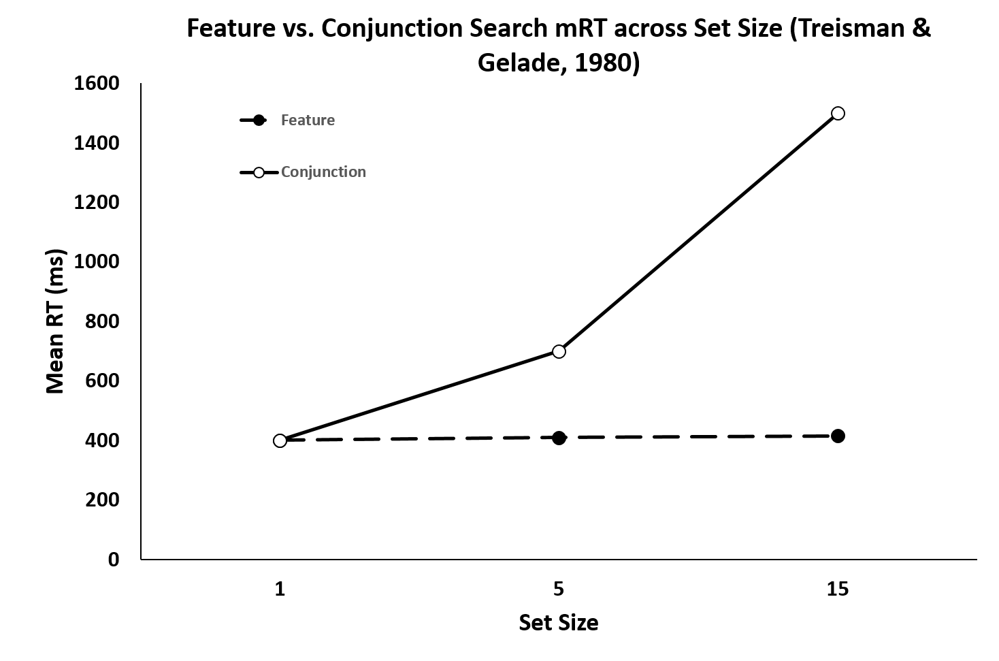
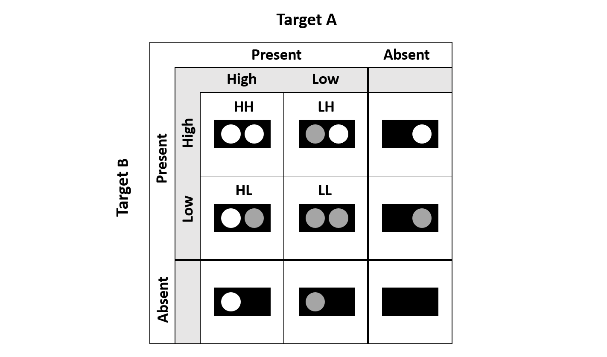
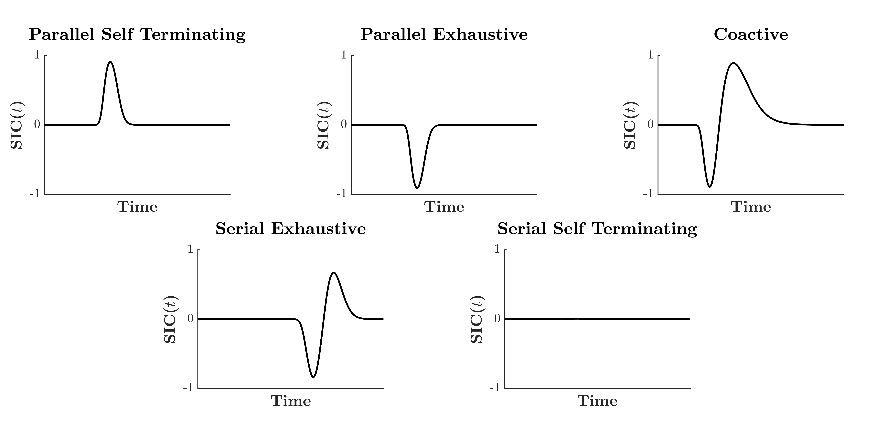

  

# Introduction
___
On the corner of a busy road, a man waits for the lights to change. Impatient to be home, he looks down at his phone and replies to a message. Glimpsing a green signal, and hearing the crossing's buzz, Tom steps out onto the road.

Our experience of the world relies upon the independent processing and seamless integration of sensory modalities. Tactile, auditory, olfactory and visual information all combine to provide a rich description of the world around us. In the above example, Tom uses visual cues --the flash of green-- and auditory cues --the buzzing signal-- to decide the street is safe to cross. In doing so, Tom frames an important question for Cognitive Scientists. How do we unify two independent sensory streams into a single conscious experience? 

## Cognitive Architecture
Since Donders' (1868) subtraction method, cognitive scientists have been using response time (RT) as a measure of cognitive processing. Donders assumed the difference in RT between two tasks of varying complexity, was a direct index of additional cognitive processing. That is to say, he assumed additional complexity resulted in strictly additive RTs. Under an additive or *Serial* cognitive system, processing on one source of information must terminate before processing on a secondary source may begin. 

More recently, Sternberg (1966, 1969; later Navon, 1977; Treisman & Gelade, 1980) used RT to show that cognitive processes need not be strictly additive. For example, in Treisman and Gelade (1980) Feature Integration Theory of Attention, it was shown that RT remained invariant across set size when participants searched a display for a singular feature (a dimension of a stimulus, such as a colour or shape), however increased monotonicity when searching for a conjunction of features (i.e., a coloured triangle; see Figure 1). As search size à la complexity increased in both conditions, these findings suggest that a singular feature can be processed irrespective of set size through an over-additive or *Parallel* cognitive system. 

  
 
<footer> *Figure 1.* Illustrative example of Mean RT across set size for Feature and Conjunction searchers, as per Treismand and Gelade's  (1980) Feature Integration Theory of Attention. </footer>

Under a parallel cognitive system, two or more process channels compete or 'race' towards finishing. If either channel provides sufficient information for a decision to be made, RT would reflect the faster of the two channels under a minimum-time 'Race Model'. However if either channel alone is insufficient to generate a response, a maximum time search will be completed with RT reflecting the slower of the two competing channels. A special case of parallel system processing, termed *Coactivation* pools both channels into a single decision accumulator, allowing for faster responses than predicted by either channel alone (see Figure 2). Together, Serial, Parallel and Coactive cognitive systems form the three primary Cognitive Architectures. 

  

<footer> *Figure 2.* Illustration of Serial, Parallel and Coactive Models. Information feeds forward through each model from input, to information or evidence accumulation, before resulting in a response generation. In the case of the serial model the dotted line indicates a minimum time or 'Self Terminating' response process strategy, where a decision is made after processing completes on the first channel accumulator. </footer>

## Stopping Rule
The *Stopping Rule* of a system determines when system processing may terminate. As mentioned above, a minimum-time or 'Self Terminating' stopping rule allows processing to terminate after completion of a single channel. This is the case in the above traffic light example, with either the completed processing of either the green 'Walk' signal, or auditory buzz signal sufficient to generate a safe crossing. By contrast a maximum time or 'Exhaustive' search process requires full processing of both channels to ensure a correct response. This is the case for a driver at a pedestrian crossing, both a green traffic light and a lack of pedestrians on the road is required for a safe trip. The difference between minimum-time and exhaustive stopping rules is illustrated as part of the Serial System in Figure 2.

## Workload Capacity
The final important aspect of system processes involves Cognitive *Workload Capacity*. Workload Capacity is a measure of cognitive efficiency, and assesses whether additional information slows or improves the rate of processing. If additional information, i.e., additional display items, slows the rate of processing the system is said to have *Limited* capacity. If the rate of processing is unaffected by additional items, the system is said to have *Unlimited* capacity. Finally, if additional items speed the rate of processing, such as in the case of Coactivation, the system is said to have *Super* capacity.

Understanding workload capacity is vital to the correct interpretation of Parallel and Serial systems. As mathematically proven by Townsend (1969, [1971](https://link.springer.com/article/10.3758/BF03205778)) any RT generated by a serial system, can reach mathematical equivalence under a parallel limited capacity model. That is to say, at the level of the 
mean RT, serial and parallel models can become entirely indistinguishable. To avoid the issue of model mimicry, Townsend created the methodology and set of analysis tools called Systems Factorial Technology.

# Systems Factorial Technology (SFT)
Systems factorial technology is a non-parametric framework and analysis technique that utilizes response time distributions to assess differences in system properties (Townsend & Nozawa, 1995) SFT compares the features of theoretical process models, to the models generated using real response time data. These theoretic process models represent unique combinations of stopping rule, capacity and architecture. Comparison of real response time models, to these unique theoretical process models (in addition to further statistical tools) allows for independent diagnosis of Architecture, Capacity and Stopping Rule, in the absence of model mimicry. 

## The Redundant Target Paradigm
SFT requires a specific empirical framework, termed the Double Factorial Design. Figure 3 illustrates Townsend and Nozawa’s (1995) classic example of a double factorial design, utilizing a redundant target task. Here participants must respond either ‘yes’ or ‘no’ to the presence of a target (e.g., dot of light), which may appear in two positions (left or right). Target presence or absence forms the first factorial level. Double target displays are redundant, as either target alone constitutes a correct ‘yes’ response.

  

<footer> *Figure 3.* Illustration of a double factorial design necessary for Systems Factorial Technology. The task is a redundant target paradigm. Each sector represents a unique stimulus display. For example, the top left cell represents the Double (redundant) Target, with a High-High target salience manipulation. Figure adapted from Townsend & Nozawa (1995). </footer>

## The Survivor Interaction Contrast

  

## The Capacity Coefficient

# New Approaches to Old Problems

